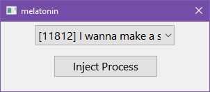

# melatonin
Application with a simple interface designed to inject a DLL that will change the sleep margin of a active process.

NOTICE: Microsoft Windows only.

   

Special Thanks to [LunarLambda](https://github.com/LunarLambda) for writing the injection code that powers this application!